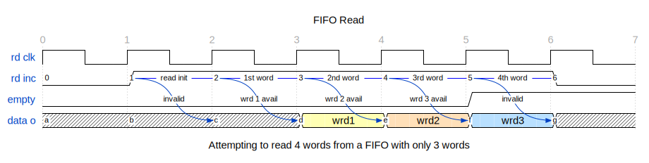

# Entity: async_fifo 
- **File**: async_fifo.vhd

## Diagram

## Description

- **Name:** asynchronous_fifo

- **Human Name:** Asynchronous FIFO

- **One-line Description:**   Asynchronous FIFO

- **One-paragraph Description:**  Asynchronous FIFO allows to transfer data from one clock domain to another.
It uses a dual port block ram. The depth of the RAM is defined by the address bits.

- **Block diagram:**

 

### Features

**Generic accepted values**
- g_DATA_WIDTH: 32
- g_ADDR_WIDTH: 5-x

**Latency**
- Clock cycles: TBD

**Running mode**
- Pipelined: Yes

**Corner cases**
- Fifo is empty: before reset, the fifo fill count is zero, all data has been read.
- Fifo is full: when the fifo fill count is equal to the fifo depth - 1.
- Fifo is almost full: when the fifo fill count is equal or more than the fifo depth - 2.
- Fifo is almost empty: when the fifo fill count is equal to 1 or less.
- Fifo is full and write data: when the fifo is full and the write enable is set, the fifo is not written.
- Fifo is empty and read data: when the fifo is empty and the read enable is set, the fifo is not read.
- Signal behavior when heap and tail counters overflows

### Future improvements
- Add generic to select the memory read and write latency.

## Generics

| Generic name | Type     | Value | Description |
| ------------ | -------- | ----- | ----------- |
| g_DATA_WIDTH | positive | 32    |             |
| g_ADDR_WIDTH | positive | 5     |             |

## Ports

| Port name    | Direction | Type                                        | Description |
| ------------ | --------- | ------------------------------------------- | ----------- |
| i_CLK_WR     | in        | std_logic                                   |             |
| i_INC_WR     | in        | std_logic                                   |             |
| i_RST_WR     | in        | std_logic                                   |             |
| i_DAT_WR     | in        | std_logic_vector(g_DATA_WIDTH - 1 downto 0) |             |
| o_FULL_FLAG  | out       | std_logic                                   |             |
| i_CLK_RD     | in        | std_logic                                   |             |
| i_INC_RD     | in        | std_logic                                   |             |
| i_RST_RD     | in        | std_logic                                   |             |
| o_DAT_RD     | out       | std_logic_vector(g_DATA_WIDTH - 1 downto 0) |             |
| o_DAT_VALID  | out       | std_logic                                   |             |
| o_EMPTY_FLAG | out       | std_logic                                   |             |

## Signals

| Name           | Type                                        | Description |
| -------------- | ------------------------------------------- | ----------- |
| s_addr_wr      | std_logic_vector(g_ADDR_WIDTH - 1 downto 0) |             |
| s_addr_rd      | std_logic_vector(g_ADDR_WIDTH - 1 downto 0) |             |
| s_ptr_wr       | std_logic_vector(g_ADDR_WIDTH downto 0)     |             |
| s_synch_ptr_wr | std_logic_vector(g_ADDR_WIDTH downto 0)     |             |
| s_ptr_rd       | std_logic_vector(g_ADDR_WIDTH downto 0)     |             |
| s_synch_ptr_rd | std_logic_vector(g_ADDR_WIDTH downto 0)     |             |
| s_full_flag    | std_logic                                   |             |
| s_empty_flag   | std_logic                                   |             |
| s_clk_wr_en    | std_logic                                   |             |

## Instantiations

- mem: dual_port_mem
- wr_ctrllr: wr_ctrl
- rd_ctrllr: rd_ctrl
- rd_2_wr: ptr_sync
- wr_2_rd: ptr_sync
