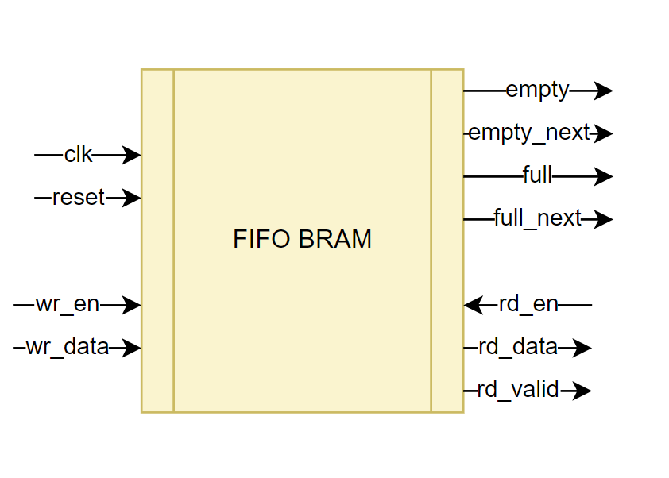

# Entity: fifo_bram 
- **File**: fifo_bram.vhd

## Diagram

## Description

- **Name:** fifo_bram

- **Human Name:** FIFO BRAM

- **One-line Description:**   Fifo module working with BRAM memory

- **One-paragraph Description:**  Fifo module that woks with BRAM memory. It has a write and read port, and flags to indicate if the fifo is empty or full.
When wr_en and full is clear, the data is written to the fifo. When rd_en and empty is clear, the data is read from the fifo.
When full is set, wr_en must be 0. And when empty is set, rd_en must be 0.
The rd_valid output is set when there is data to read and rd_en is set. The fill_count output indicates the number of elements in the fifo.
The fifo has a depth of 511 and a width of 32 bits.
The fifo is pipelined and the latency is one clock cycle to write data and cero clock cycles to read data.

- **Block diagram:**

### Features

**Generic accepted values**
- RAM_WIDTH: 32
- RAM_DEPTH: 512

**Latency**
- Clock cycles: One cycle to write data and cero cycles to read data.

**Running mode**
- Pipelined: Yes

**Corner cases**
- Fifo is empty: before reset, the fifo fill count is zero, all data has been read.
- Fifo is full: when the fifo fill count is equal to the fifo depth - 1.
- Fifo is almost full: when the fifo fill count is equal or more than the fifo depth - 2.
- Fifo is almost empty: when the fifo fill count is equal to 1 or less.
- Fifo is full and write data: when the fifo is full and the write enable is set, the fifo is not written.
- Fifo is empty and read data: when the fifo is empty and the read enable is set, the fifo is not read.
- Signal behavior when heap and tail counters overflows

### Future improvements
- Add generic to select the memory read and write latency.

## Generics

| Generic name | Type    | Value | Description           |
| ------------ | ------- | ----- | --------------------- |
| RAM_WIDTH    | natural | 32    | Word width            |
| RAM_DEPTH    | natural | 512   | Depth of the FIFO + 1 |

## Ports

| Port name  | Direction | Type                                     | Description                       |
| ---------- | --------- | ---------------------------------------- | --------------------------------- |
| clk        | in        | std_logic                                | input clock                       |
| rst        | in        | std_logic                                | rest signal high active           |
| wr_en      | in        | std_logic                                | write enable                      |
| wr_data    | in        | std_logic_vector(RAM_WIDTH - 1 downto 0) | data input                        |
| rd_en      | in        | std_logic                                | read enable                       |
| rd_valid   | out       | std_logic                                | read valid. There is data to read |
| rd_data    | out       | std_logic_vector(RAM_WIDTH - 1 downto 0) | data output                       |
| empty      | out       | std_logic                                | fifo is empty                     |
| empty_next | out       | std_logic                                | fifo will be empty next cycle     |
| full       | out       | std_logic                                | fifo is full                      |
| full_next  | out       | std_logic                                | fifo will be full next cycle      |
| fill_count | out       | integer range RAM_DEPTH - 1 downto 0     | Number of elements in the FIFO    |

## Signals

| Name         | Type                             | Description |
| ------------ | -------------------------------- | ----------- |
| ram          | ram_type                         |             |
| head         | integer range 0 to RAM_DEPTH - 1 |             |
| tail         | integer range 0 to RAM_DEPTH - 1 |             |
| empty_i      | std_logic                        |             |
| full_i       | std_logic                        |             |
| fill_count_i | integer range 0 to RAM_DEPTH - 1 |             |

## Types

| Name     | Type | Description |
| -------- | ---- | ----------- |
| ram_type |      |             |

## Processes
- PROC_HEAD: ( clk )
- PROC_TAIL: ( clk )
- PROC_RAM: ( clk )
- PROC_COUNT: ( head, tail )
